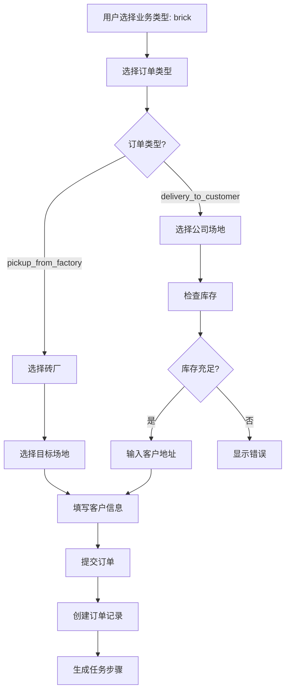
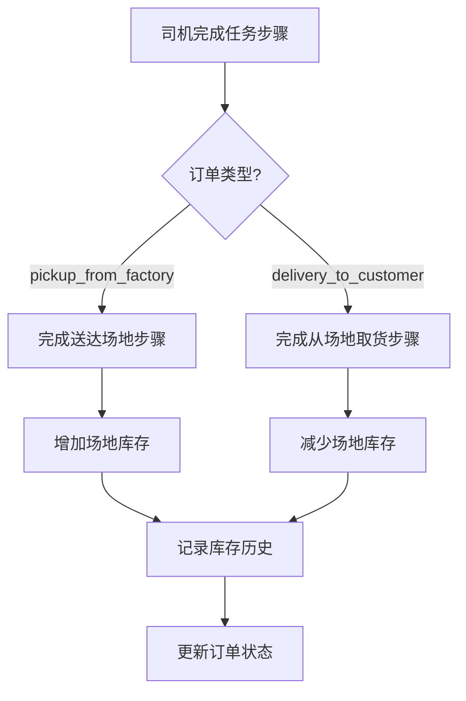

# 技术设计文档

## Overview

本设计文档描述了在现有垃圾桶租赁管理系统中添加砖块配送业务类型的技术实现方案。该功能将使系统能够同时管理两种独立的业务类型：垃圾桶租赁（garbage）和砖块配送（brick）。

砖块配送业务涉及从砖厂取砖、在公司场地存储、以及向客户配送的完整流程。系统需要支持两种砖块订单类型：
1. **从砖厂取砖** (pickup_from_factory): 从砖厂取砖并运送到公司场地存储
2. **送砖给客户** (delivery_to_customer): 从公司场地取砖并配送给客户

核心设计原则：
- **向后兼容**: 现有垃圾桶业务功能不受影响，默认业务类型为 'garbage'
- **数据隔离**: 不同业务类型的数据通过 business_type 字段区分和过滤
- **库存追踪**: 实时追踪每个公司场地的砖块库存数量
- **UI一致性**: 在所有主要页面提供统一的业务类型切换器

## Architecture

### 系统架构层次

```
┌─────────────────────────────────────────────────────────────┐
│                      Presentation Layer                      │
│  ┌──────────────┐  ┌──────────────┐  ┌──────────────┐      │
│  │ OrdersPage   │  │ FleetMapPage │  │ DispatchPage │      │
│  │ + BizType    │  │ + BizType    │  │ + BizType    │      │
│  │   Selector   │  │   Selector   │  │   Selector   │      │
│  └──────────────┘  └──────────────┘  └──────────────┘      │
│  ┌──────────────┐  ┌──────────────┐  ┌──────────────┐      │
│  │CreateOrderPg │  │ ReportsPage  │  │BrickLocations│      │
│  │ + BizType    │  │ + BizType    │  │    Page      │      │
│  │   Selector   │  │   Selector   │  │              │      │
│  └──────────────┘  └──────────────┘  └──────────────┘      │
└─────────────────────────────────────────────────────────────┘
                            │
                            ▼
┌─────────────────────────────────────────────────────────────┐
│                      Business Logic Layer                    │
│  ┌──────────────────────────────────────────────────────┐  │
│  │  Business Type Context (LocalStorage)                │  │
│  │  - Persist selected business type across pages       │  │
│  └──────────────────────────────────────────────────────┘  │
│  ┌──────────────────────────────────────────────────────┐  │
│  │  Inventory Management Logic                          │  │
│  │  - Track brick inventory per company yard            │  │
│  │  - Validate inventory before delivery orders         │  │
│  │  - Update inventory on order completion              │  │
│  └──────────────────────────────────────────────────────┘  │
└─────────────────────────────────────────────────────────────┘
                            │
                            ▼
┌─────────────────────────────────────────────────────────────┐
│                      Data Access Layer                       │
│  ┌──────────────────────────────────────────────────────┐  │
│  │  Supabase Client                                     │  │
│  │  - Query orders by business_type                     │  │
│  │  - Query brick_factories, company_yards              │  │
│  │  - Query brick_inventory_history                     │  │
│  └──────────────────────────────────────────────────────┘  │
└─────────────────────────────────────────────────────────────┘
                            │
                            ▼
┌─────────────────────────────────────────────────────────────┐
│                      Database Layer (Supabase)               │
│  ┌──────────────┐  ┌──────────────┐  ┌──────────────┐      │
│  │   orders     │  │brick_factories│ │company_yards │      │
│  │ +business_   │  │              │  │ +inventory_  │      │
│  │  type        │  │              │  │  count       │      │
│  │ +brick_order_│  │              │  │              │      │
│  │  type        │  │              │  │              │      │
│  └──────────────┘  └──────────────┘  └──────────────┘      │
│  ┌──────────────────────────────────────────────────────┐  │
│  │   brick_inventory_history                            │  │
│  │   - Track all inventory changes                      │  │
│  └──────────────────────────────────────────────────────┘  │
└─────────────────────────────────────────────────────────────┘
```

### 数据流图

#### 砖块订单创建流程



#### 库存更新流程



## Components and Interfaces

### 1. BusinessTypeSelector 组件

**职责**: 提供统一的业务类型切换UI组件

**接口定义**:
```typescript
interface BusinessTypeSelectorProps {
  value: 'garbage' | 'brick';
  onChange: (value: 'garbage' | 'brick') => void;
  className?: string;
}

export function BusinessTypeSelector({ 
  value, 
  onChange, 
  className 
}: BusinessTypeSelectorProps): JSX.Element
```

**实现细节**:
- 使用 Tabs 组件实现切换器
- 显示图标和文字标签：🗑️ 垃圾桶业务 / 🧱 砖块业务
- 自动持久化选择到 localStorage (key: 'business_type')
- 提供清晰的视觉反馈显示当前选中状态

**使用位置**:
- OrdersPage (订单列表页面)
- FleetMapPage (地图视图页面)
- DispatchPage (调度视图页面)
- CreateOrderPage (创建订单页面)
- ReportsPage (报表页面)

### 2. BrickOrderTypeSelector 组件

**职责**: 在创建砖块订单时选择订单类型

**接口定义**:
```typescript
interface BrickOrderTypeSelectorProps {
  value: 'pickup_from_factory' | 'delivery_to_customer';
  onChange: (value: 'pickup_from_factory' | 'delivery_to_customer') => void;
}

export function BrickOrderTypeSelector({ 
  value, 
  onChange 
}: BrickOrderTypeSelectorProps): JSX.Element
```

**实现细节**:
- 使用 RadioGroup 或 Tabs 组件
- 显示两个选项：
  - 🏭 从砖厂取砖
  - 🚚 送砖给客户
- 根据选择动态显示不同的表单字段

### 3. BrickLocationSelector 组件

**职责**: 选择砖厂或公司场地

**接口定义**:
```typescript
interface BrickLocationSelectorProps {
  type: 'factory' | 'yard';
  value: string | null;
  onChange: (value: string) => void;
  showInventory?: boolean; // 是否显示库存信息（仅场地）
}

export function BrickLocationSelector({ 
  type, 
  value, 
  onChange,
  showInventory 
}: BrickLocationSelectorProps): JSX.Element
```

**实现细节**:
- 使用 Select 组件
- 从 Supabase 查询活跃的砖厂或场地列表
- 如果 type='yard' 且 showInventory=true，显示当前库存数量
- 只显示 is_active=true 的位置

### 4. BrickLocationsPage 页面组件

**职责**: 管理砖厂和公司场地信息

**功能模块**:
1. **砖厂管理区域**
   - 显示所有砖厂列表（表格）
   - 添加新砖厂按钮
   - 编辑砖厂信息
   - 激活/停用砖厂

2. **公司场地管理区域**
   - 显示所有场地列表（表格）
   - 显示当前库存数量
   - 添加新场地按钮
   - 编辑场地信息
   - 激活/停用场地
   - 查看库存历史按钮
   - 手动调整库存按钮

3. **库存历史对话框**
   - 显示选定场地的库存变更记录
   - 包含时间、订单号、变更数量、变更后库存

4. **手动调整库存对话框**
   - 输入调整数量（正数或负数）
   - 必填原因说明
   - 记录到库存历史

**权限控制**:
- 仅 admin 和 manager 角色可访问

### 5. 修改现有页面组件

#### OrdersPage 修改
- 添加 BusinessTypeSelector 组件
- 根据选择的业务类型过滤订单
- 当 business_type='brick' 时：
  - 显示 brick_order_type 列
  - 显示起点和终点位置列
  - 隐藏 bin_number, bin_size 列
- 当 business_type='garbage' 时：
  - 保持现有列显示

#### FleetMapPage 修改
- 添加 BusinessTypeSelector 组件
- 根据选择的业务类型过滤地图标记
- 当 business_type='brick' 时：
  - 显示砖厂标记（蓝色工厂图标）
  - 显示公司场地标记（绿色仓库图标）
  - 显示客户地址标记（橙色客户图标）
  - 点击场地标记显示库存信息
- 当 business_type='garbage' 时：
  - 保持现有标记显示

#### DispatchPage 修改
- 添加 BusinessTypeSelector 组件
- 根据选择的业务类型过滤调度任务
- 当 business_type='brick' 时：
  - 显示 brick_order_type
  - 显示起点和终点位置
  - 生成砖块业务特定的任务步骤
- 当 business_type='garbage' 时：
  - 保持现有显示

#### CreateOrderPage 修改
- 添加 BusinessTypeSelector 组件
- 当 business_type='brick' 时：
  - 显示 BrickOrderTypeSelector
  - 根据订单类型显示不同的位置选择器
  - 隐藏 bin_size, bin_type 字段
  - 添加库存验证逻辑
- 当 business_type='garbage' 时：
  - 保持现有表单字段

#### ReportsPage 修改
- 添加 BusinessTypeSelector 组件
- 根据选择的业务类型过滤报表数据
- 分别计算每种业务类型的指标

## Data Models

### 数据库架构变更

#### 1. 修改 orders 表

```sql
-- 添加业务类型枚举
CREATE TYPE public.business_type AS ENUM ('garbage', 'brick');

-- 添加砖块订单类型枚举
CREATE TYPE public.brick_order_type AS ENUM ('pickup_from_factory', 'delivery_to_customer');

-- 修改 orders 表
ALTER TABLE public.orders 
  ADD COLUMN business_type public.business_type NOT NULL DEFAULT 'garbage',
  ADD COLUMN brick_order_type public.brick_order_type,
  ADD COLUMN origin_factory_id UUID REFERENCES public.brick_factories(id),
  ADD COLUMN origin_yard_id UUID REFERENCES public.company_yards(id),
  ADD COLUMN destination_yard_id UUID REFERENCES public.company_yards(id);

-- 添加约束：砖块订单必须有 brick_order_type
ALTER TABLE public.orders 
  ADD CONSTRAINT check_brick_order_type 
  CHECK (
    (business_type = 'brick' AND brick_order_type IS NOT NULL) OR
    (business_type = 'garbage' AND brick_order_type IS NULL)
  );

-- 添加约束：pickup_from_factory 订单必须有砖厂和目标场地
ALTER TABLE public.orders 
  ADD CONSTRAINT check_pickup_from_factory 
  CHECK (
    (brick_order_type = 'pickup_from_factory' AND origin_factory_id IS NOT NULL AND destination_yard_id IS NOT NULL) OR
    (brick_order_type != 'pickup_from_factory')
  );

-- 添加约束：delivery_to_customer 订单必须有起始场地
ALTER TABLE public.orders 
  ADD CONSTRAINT check_delivery_to_customer 
  CHECK (
    (brick_order_type = 'delivery_to_customer' AND origin_yard_id IS NOT NULL) OR
    (brick_order_type != 'delivery_to_customer')
  );

-- 添加索引以提高查询性能
CREATE INDEX idx_orders_business_type ON public.orders(business_type);
CREATE INDEX idx_orders_brick_order_type ON public.orders(brick_order_type);
```

#### 2. 创建 brick_factories 表

```sql
CREATE TABLE public.brick_factories (
  id UUID PRIMARY KEY DEFAULT gen_random_uuid(),
  name TEXT NOT NULL,
  address TEXT NOT NULL,
  latitude NUMERIC(10, 7) NOT NULL,
  longitude NUMERIC(10, 7) NOT NULL,
  contact_name TEXT,
  contact_phone TEXT,
  notes TEXT,
  is_active BOOLEAN DEFAULT true,
  created_at TIMESTAMPTZ DEFAULT now(),
  updated_at TIMESTAMPTZ DEFAULT now()
);

-- 启用 RLS
ALTER TABLE public.brick_factories ENABLE ROW LEVEL SECURITY;

-- 创建策略
CREATE POLICY "open_all" ON public.brick_factories 
  FOR ALL USING (true) WITH CHECK (true);

-- 创建索引
CREATE INDEX idx_brick_factories_active ON public.brick_factories(is_active);
```

#### 3. 创建 company_yards 表

```sql
CREATE TABLE public.company_yards (
  id UUID PRIMARY KEY DEFAULT gen_random_uuid(),
  name TEXT NOT NULL,
  address TEXT NOT NULL,
  latitude NUMERIC(10, 7) NOT NULL,
  longitude NUMERIC(10, 7) NOT NULL,
  max_capacity INTEGER NOT NULL DEFAULT 1000,
  current_inventory INTEGER NOT NULL DEFAULT 0,
  contact_name TEXT,
  contact_phone TEXT,
  notes TEXT,
  is_active BOOLEAN DEFAULT true,
  created_at TIMESTAMPTZ DEFAULT now(),
  updated_at TIMESTAMPTZ DEFAULT now()
);

-- 启用 RLS
ALTER TABLE public.company_yards ENABLE ROW LEVEL SECURITY;

-- 创建策略
CREATE POLICY "open_all" ON public.company_yards 
  FOR ALL USING (true) WITH CHECK (true);

-- 添加约束：库存不能为负
ALTER TABLE public.company_yards 
  ADD CONSTRAINT check_inventory_non_negative 
  CHECK (current_inventory >= 0);

-- 添加约束：库存不能超过最大容量
ALTER TABLE public.company_yards 
  ADD CONSTRAINT check_inventory_within_capacity 
  CHECK (current_inventory <= max_capacity);

-- 创建索引
CREATE INDEX idx_company_yards_active ON public.company_yards(is_active);
```

#### 4. 创建 brick_inventory_history 表

```sql
CREATE TABLE public.brick_inventory_history (
  id UUID PRIMARY KEY DEFAULT gen_random_uuid(),
  yard_id UUID REFERENCES public.company_yards(id) ON DELETE CASCADE NOT NULL,
  order_id UUID REFERENCES public.orders(id) ON DELETE SET NULL,
  change_type TEXT NOT NULL, -- 'order_pickup', 'order_delivery', 'manual_adjustment'
  quantity_change INTEGER NOT NULL, -- 正数表示增加，负数表示减少
  inventory_before INTEGER NOT NULL,
  inventory_after INTEGER NOT NULL,
  reason TEXT, -- 手动调整时必填
  created_by UUID REFERENCES public.profiles(id),
  created_at TIMESTAMPTZ DEFAULT now()
);

-- 启用 RLS
ALTER TABLE public.brick_inventory_history ENABLE ROW LEVEL SECURITY;

-- 创建策略
CREATE POLICY "open_all" ON public.brick_inventory_history 
  FOR ALL USING (true) WITH CHECK (true);

-- 创建索引
CREATE INDEX idx_brick_inventory_history_yard ON public.brick_inventory_history(yard_id);
CREATE INDEX idx_brick_inventory_history_order ON public.brick_inventory_history(order_id);
CREATE INDEX idx_brick_inventory_history_created_at ON public.brick_inventory_history(created_at DESC);
```

### TypeScript 类型定义

```typescript
// 业务类型
export type BusinessType = 'garbage' | 'brick';

// 砖块订单类型
export type BrickOrderType = 'pickup_from_factory' | 'delivery_to_customer';

// 砖厂
export interface BrickFactory {
  id: string;
  name: string;
  address: string;
  latitude: number;
  longitude: number;
  contact_name?: string;
  contact_phone?: string;
  notes?: string;
  is_active: boolean;
  created_at: string;
  updated_at: string;
}

// 公司场地
export interface CompanyYard {
  id: string;
  name: string;
  address: string;
  latitude: number;
  longitude: number;
  max_capacity: number;
  current_inventory: number;
  contact_name?: string;
  contact_phone?: string;
  notes?: string;
  is_active: boolean;
  created_at: string;
  updated_at: string;
}

// 库存历史记录
export interface BrickInventoryHistory {
  id: string;
  yard_id: string;
  order_id?: string;
  change_type: 'order_pickup' | 'order_delivery' | 'manual_adjustment';
  quantity_change: number;
  inventory_before: number;
  inventory_after: number;
  reason?: string;
  created_by?: string;
  created_at: string;
}

// 扩展的订单类型
export interface Order {
  id: string;
  order_number: string;
  type: string;
  business_type: BusinessType;
  brick_order_type?: BrickOrderType;
  origin_factory_id?: string;
  origin_yard_id?: string;
  destination_yard_id?: string;
  bin_size?: string;
  bin_type?: string;
  service_date: string;
  time_window: string;
  time_window_custom?: string;
  address: string;
  customer_name: string;
  customer_phone: string;
  customer_notes?: string;
  status: string;
  netsuite_order_id?: string;
  created_at: string;
  updated_at: string;
}
```

## Error Handling

### 1. 库存验证错误

**场景**: 创建 delivery_to_customer 订单时，选定的场地库存为 0

**处理**:
```typescript
if (brickOrderType === 'delivery_to_customer' && selectedYard.current_inventory === 0) {
  toast.error(`场地 ${selectedYard.name} 当前库存为 0，无法创建配送订单`);
  return;
}
```

### 2. 位置引用完整性错误

**场景**: 尝试删除被订单引用的砖厂或场地

**处理**:
```typescript
// 在删除前检查引用
const { data: referencedOrders } = await supabase
  .from('orders')
  .select('id')
  .or(`origin_factory_id.eq.${factoryId},origin_yard_id.eq.${factoryId},destination_yard_id.eq.${factoryId}`)
  .limit(1);

if (referencedOrders && referencedOrders.length > 0) {
  toast.error('该位置被订单引用，无法删除。请先停用该位置。');
  return;
}
```

### 3. 库存更新并发错误

**场景**: 多个订单同时完成导致库存更新冲突

**处理**:
- 使用数据库事务确保原子性
- 在触发器中使用 SELECT FOR UPDATE 锁定行
- 如果更新失败，重试或通知管理员

### 4. 业务类型不匹配错误

**场景**: 尝试将垃圾桶订单分配给砖块业务的司机

**处理**:
```typescript
// 在分配前验证业务类型匹配
if (order.business_type !== driverBusinessType) {
  toast.error('订单业务类型与司机业务类型不匹配');
  return;
}
```

### 5. 数据迁移错误

**场景**: 迁移脚本执行失败

**处理**:
- 在迁移脚本中使用事务
- 提供回滚脚本
- 记录详细的错误日志
- 在测试环境充分测试后再部署到生产环境

## Testing Strategy

### 单元测试

#### 1. BusinessTypeSelector 组件测试
- 测试组件渲染
- 测试切换业务类型
- 测试 localStorage 持久化
- 测试 onChange 回调

#### 2. BrickLocationSelector 组件测试
- 测试砖厂列表加载
- 测试场地列表加载
- 测试库存信息显示
- 测试只显示活跃位置

#### 3. 库存管理逻辑测试
- 测试库存增加逻辑
- 测试库存减少逻辑
- 测试库存验证逻辑
- 测试库存历史记录创建

### 集成测试

#### 1. 砖块订单创建流程测试
- 测试 pickup_from_factory 订单创建
- 测试 delivery_to_customer 订单创建
- 测试库存不足时的错误处理
- 测试订单创建后的任务步骤生成

#### 2. 库存更新流程测试
- 测试完成 pickup_from_factory 订单后库存增加
- 测试完成 delivery_to_customer 订单后库存减少
- 测试库存历史记录正确创建
- 测试并发订单完成时的库存一致性

#### 3. 业务类型过滤测试
- 测试 OrdersPage 按业务类型过滤
- 测试 FleetMapPage 按业务类型过滤标记
- 测试 DispatchPage 按业务类型过滤任务
- 测试 ReportsPage 按业务类型计算指标

### 端到端测试

#### 1. 完整砖块业务流程测试
1. 管理员添加砖厂和场地
2. 创建 pickup_from_factory 订单
3. 分配司机和车辆
4. 司机完成取砖任务
5. 验证场地库存增加
6. 创建 delivery_to_customer 订单
7. 分配司机和车辆
8. 司机完成送砖任务
9. 验证场地库存减少
10. 验证库存历史记录

#### 2. 业务类型切换测试
1. 在 OrdersPage 切换业务类型
2. 验证订单列表更新
3. 导航到 FleetMapPage
4. 验证业务类型保持一致
5. 验证地图标记正确显示
6. 导航到 DispatchPage
7. 验证业务类型保持一致
8. 验证调度任务正确过滤

### 数据迁移测试

#### 1. 向后兼容性测试
- 验证现有订单自动设置 business_type='garbage'
- 验证现有功能不受影响
- 验证现有 API 端点继续工作

#### 2. 数据完整性测试
- 验证所有约束正确应用
- 验证外键关系正确建立
- 验证索引正确创建

### 性能测试

#### 1. 查询性能测试
- 测试按 business_type 过滤订单的查询性能
- 测试地图标记加载性能
- 测试库存历史查询性能

#### 2. 并发测试
- 测试多个订单同时完成时的库存更新性能
- 测试多个用户同时切换业务类型的性能

### 测试数据准备

#### 1. 砖厂测试数据
```sql
INSERT INTO public.brick_factories (name, address, latitude, longitude, is_active)
VALUES 
  ('砖厂A', '123 Factory St, Toronto, ON', 43.6532, -79.3832, true),
  ('砖厂B', '456 Brick Ave, Toronto, ON', 43.6612, -79.3952, true),
  ('砖厂C (停用)', '789 Old Rd, Toronto, ON', 43.6432, -79.4032, false);
```

#### 2. 公司场地测试数据
```sql
INSERT INTO public.company_yards (name, address, latitude, longitude, max_capacity, current_inventory, is_active)
VALUES 
  ('场地1', '111 Yard St, Toronto, ON', 43.6632, -79.3732, 1000, 500, true),
  ('场地2', '222 Storage Ave, Toronto, ON', 43.6732, -79.3632, 800, 0, true),
  ('场地3 (停用)', '333 Old Yard Rd, Toronto, ON', 43.6532, -79.3932, 500, 100, false);
```

#### 3. 砖块订单测试数据
```sql
-- pickup_from_factory 订单
INSERT INTO public.orders (
  order_number, type, business_type, brick_order_type, 
  origin_factory_id, destination_yard_id,
  service_date, time_window, address, customer_name, customer_phone, status
)
VALUES (
  'KD-20260501-001', 'delivery', 'brick', 'pickup_from_factory',
  (SELECT id FROM brick_factories WHERE name = '砖厂A'),
  (SELECT id FROM company_yards WHERE name = '场地1'),
  '2026-05-01', 'AM', '场地1地址', '公司', '416-555-0100', 'pending'
);

-- delivery_to_customer 订单
INSERT INTO public.orders (
  order_number, type, business_type, brick_order_type, 
  origin_yard_id,
  service_date, time_window, address, customer_name, customer_phone, status
)
VALUES (
  'KD-20260501-002', 'delivery', 'brick', 'delivery_to_customer',
  (SELECT id FROM company_yards WHERE name = '场地1'),
  '2026-05-01', 'PM', '999 Customer St, Toronto, ON', '张三', '416-555-0123', 'pending'
);
```
